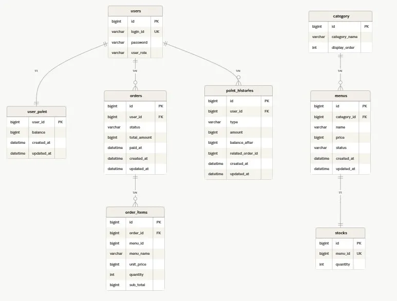

# 카페 셀프 오더 시스템

> 키오스크·모바일 앱에서 사용자가 직접 메뉴를 선택해 주문·결제하는 백엔드 시스템.
> **"다중 인스턴스 환경에서 정확성을 어떻게 보장할 것인가"** 를 핵심 과제로 설정했다.

| 항목 | 내용 |
|------|------|
| 기간 | 5일 (설계 1일 + 개발 3일 + 마무리 1일) |
| 스택 | Spring Boot 3.5.14 · Java 17 · MySQL 8 · Redis(Redisson) · Kafka · Flyway |
| 핵심 평가 | 다중 인스턴스 동시성 제어 · 데이터 정합성 · 테스트 |

---

## 🎯 설계 핵심: 왜 이 선택을 했나

### 1. 자원별 락 전략을 분리한 이유

"분산락이 더 좋다"는 단순한 선택이 아니라, **자원마다 충돌 특성이 다르기 때문에 락 전략도 다르게 적용**했다.

| 자원 | 전략 | 이유 |
|------|------|------|
| 포인트 충전 | Redisson 분산락 + DB 비관적 락 | 외부 호출(PG 확장) 가능성 고려. 분산락으로 직렬화, DB 락으로 안전장치 이중 보호 |
| 포인트 차감 (주문) | DB 비관적 락만 | 트랜잭션이 짧고 외부 호출 없음. 분산락 오버헤드 불필요 |
| 재고 차감 | DB 비관적 락 + menuId 오름차순 획득 | 다중 메뉴 주문 시 데드락 방지를 위해 항상 같은 순서로 락 획득 |
| 스케줄러 | Redisson 분산락 (waitTime=0) | 다중 인스턴스 환경에서 03:00 보정 작업이 중복 실행되지 않도록 |

### 2. 인기 메뉴 정확성을 3중 구조로 보장한 이유

Kafka 단독으로는 메시지 유실 시 Redis 데이터가 틀어진다. 단일 도구에 의존하지 않고 **진실의 원천(DB)과 빠른 응답(Redis)을 분리하고, 스케줄러로 일관성을 보정**하는 구조를 선택했다.

```
[실시간]  주문 완료 → Kafka order.completed → Redis ZINCRBY (빠른 반영)
[조회]    GET /api/menus/popular → Redis ZSET (빠른 응답)
[보정]    매일 03:00 스케줄러 → DB 집계 기준으로 ZSET 재구성 (정합성 보장)
```

### 3. Kafka 발행을 AFTER_COMMIT으로 한 이유

트랜잭션 내부에서 Kafka를 직접 발행하면, 트랜잭션이 롤백돼도 이미 발행된 이벤트는 취소되지 않는다.
`@TransactionalEventListener(phase = AFTER_COMMIT)` 으로 **커밋이 확정된 뒤에만 발행**해 유령 이벤트를 차단했다.

### 4. 애그리거트 간 참조를 Long ID로만 한 이유

`Order → User`, `Stock → Menu`, `PointHistory → Order` 등 도메인 경계를 넘는 참조는 `@ManyToOne` 대신 **Long ID만 보관**한다.
LAZY 로딩 실수로 인한 N+1, LazyInitializationException을 원천 차단하고, 도메인을 독립적으로 유지해 추후 모듈 분리가 쉬워진다.
같은 애그리거트 내부(`OrderItem → Order`)는 연관관계를 그대로 사용한다.

### 5. 의도적으로 선택하지 않은 것들

| 검토 항목 | 미도입 이유 |
|-----------|-------------|
| Transactional Outbox 패턴 | 인기 메뉴 집계는 약간의 유실 허용 가능. 5일 일정 대비 복잡도 과도 |
| Refresh Token | 인증 도메인 비중 축소, 핵심 동시성에 시간 집중 |
| 가점유 재고 모델 | 포인트 즉시 결제라 가점유 시간 매우 짧음. 단순 차감-복구로 충분 |
| 낙관적 락(@Version) | 충돌 빈도가 높은 자원(포인트·재고)에는 재시도 비용이 더 큼 |
| QueryDSL | 현재 쿼리가 단순 필터·집계 수준 → JPQL `@Query`로 충분. 의존성은 유지 |

---

## 📐 ERD

```
category                    menus                           stocks
├── id (PK)                 ├── id (PK)                     ├── id (PK)
├── category_name           ├── category_id (FK→category)   ├── menu_id (UNIQUE, FK→menus)
└── display_order           ├── name                        └── quantity
                            ├── price
                            ├── status
                            ├── created_at
                            └── updated_at

users                       user_point
├── id (PK)                 ├── user_id (PK, FK→users)
├── login_id (UNIQUE)       ├── balance
├── password                ├── created_at
└── user_role               └── updated_at

orders                          order_items
├── id (PK)                     ├── id (PK)
├── user_id (FK→users)          ├── order_id (FK→orders)
├── status                      ├── menu_id              ← FK 없음 (ID만 보관)
├── total_amount                ├── menu_name            ← 주문 당시 스냅샷
├── paid_at                     ├── unit_price           ← 주문 당시 스냅샷
├── created_at                  ├── quantity
└── updated_at                  └── sub_total

point_histories
├── id (PK)
├── user_id (FK→users)
├── type (CHARGE / USE)
├── amount               ← 충전 양수 / 사용 음수
├── balance_after
├── related_order_id     ← nullable, FK 없음 (ID만 보관)
├── created_at
└── updated_at
```

> **설계 원칙**: 애그리거트 간 참조는 Long ID로만 연결한다.
> `order_items.menu_id`, `point_histories.related_order_id` 는 DB FK 없이 ID만 보관해 도메인 경계를 명확히 유지한다.

---

## 🌐 API 명세

> 모든 엔드포인트는 `/api` prefix를 포함한다.
> 인증이 필요한 API는 `Authorization: Bearer {accessToken}` 헤더 필요. AccessToken 유효시간: **30분**

### 인증

| Method | URI | 설명 | 인증 | 상태코드 |
|--------|-----|------|------|----------|
| POST | `/api/auth/signup` | 회원가입 | 불필요 | 201 |
| POST | `/api/auth/login` | 로그인 → AccessToken 발급 | 불필요 | 200 |

### 메뉴

| Method | URI | 설명 | 인증 | 상태코드 |
|--------|-----|------|------|----------|
| GET | `/api/menus?categoryId={id}` | 메뉴 목록 조회 (카테고리 필터 선택) | 불필요 | 200 |
| GET | `/api/menus/popular` | 인기 메뉴 Top 3 (Redis ZSET 기반) | 불필요 | 200 |

### 포인트

| Method | URI | 설명 | 인증 | 상태코드 |
|--------|-----|------|------|----------|
| POST | `/api/points/charge` | 포인트 충전 (100 ~ 1,000,000원) | 필요 | 201 |
| GET | `/api/points/balance` | 잔액 조회 | 필요 | 200 |
| GET | `/api/points/history` | 충전·사용 이력 조회 (최신순) | 필요 | 200 |

### 주문

| Method | URI | 설명 | 인증 | 상태코드 |
|--------|-----|------|------|----------|
| POST | `/api/orders` | 주문·결제 (재고 차감 + 포인트 차감 + Kafka 발행) | 필요 | 200 |

### 공통 응답 구조

**성공**
```json
{ "data": { ... } }
```

**에러**
```json
{
  "code": "P003",
  "message": "포인트 잔액이 부족합니다.",
  "details": { "required": 10000, "current": 7500, "shortage": 2500 }
}
```

> 에러 코드 체계: 도메인별 prefix (A/U/M/S/P/O/L/G) + 3자리 번호. 전체 목록은 `07_에러코드_설계서.md` 참조.

### JWT 페이로드 구조

```json
{ "sub": "1", "loginId": "kim_jiyeon", "role": "USER" }
```

---

## 📦 패키지 구조

```
src/main/java/org/example/spartacafe/
│
├── SpartaCafeApplication.java
│
├── domain/
│   ├── menu/
│   │   ├── controller/    MenuController
│   │   ├── dto/           MenuResponse, PopularMenuResponse
│   │   ├── entity/        Menu, Category
│   │   ├── enums/         MenuStatus
│   │   ├── repository/    MenuRepository
│   │   └── service/       MenuService
│   │
│   ├── order/
│   │   ├── controller/    OrderController
│   │   ├── dto/           request/OrderRequest, response/OrderResponse
│   │   ├── entity/        Order, OrderItem
│   │   ├── enums/         OrderStatus
│   │   ├── event/         OrderCompletedEvent       ← AFTER_COMMIT 트리거
│   │   ├── kafka/         OrderKafkaProducer, OrderKafkaConsumer
│   │   ├── repository/    OrderRepository, OrderItemRepository, OrderQueryRepository
│   │   └── service/       OrderService
│   │
│   ├── point/
│   │   ├── controller/    UserPointController
│   │   ├── dto/           request/PointChargeRequest
│   │   │                  response/PointBalanceResponse, PointChargeResponse, PointHistoryResponse
│   │   ├── entity/        UserPoint, PointHistory
│   │   ├── enums/         PointType
│   │   ├── repository/    UserPointRepository, PointHistoryRepository
│   │   └── service/       UserPointService
│   │
│   ├── stock/
│   │   ├── entity/        Stock                     ← StockService 없음
│   │   └── repository/    StockRepository           ← OrderService에서 직접 사용
│   │
│   └── user/
│       ├── controller/    UserController
│       ├── dto/           request/SignUpRequest, LoginRequest
│       │                  response/SignUpResponse, LoginResponse
│       ├── entity/        User
│       ├── enums/         UserRole
│       ├── repository/    UserRepository
│       └── service/       UserService
│
├── global/
│   ├── common/            BaseEntity
│   ├── config/            SecurityConfig, RedissonConfig, JpaAuditingConfig, SwaggerConfig
│   │   └── kafka/         KafkaProducerConfig, KafkaConsumerConfig, KafkaTopic
│   ├── exception/         ErrorCode, BusinessException, GlobalExceptionHandler
│   ├── response/          ApiResponse, ErrorResponse
│   └── security/          JwtProvider, JwtAuthFilter, JwtAuthEntryPoint,
│                          JwtAccessDeniedHandler, SecurityResponseUtil, CustomUserDetails
│
└── scheduler/
    └── PopularMenuRebuildScheduler                  ← 매일 03:00 ZSET 재구성
```

---

## 🚀 실행 방법

### 사전 준비

- Docker Desktop 실행 중인지 확인
- JDK 17 설치
- 프로젝트 루트에 `.env` 파일 생성 (`.env.example` 참고)

### 실행

**방법 1 — IntelliJ Run Configuration (권장)**

1. 상단 메뉴 **Run → Edit Configurations**
2. **+** 버튼 → **Shell Script** 선택
3. 아래 값 입력

| 항목 | 값 |
|------|-----|
| Script path | `$ProjectFileDir$/scripts/run.sh` |
| Working directory | `$ProjectFileDir$` |
| Interpreter path | `C:\Program Files\Git\bin\bash.exe` |
| Execute in the terminal | ✅ 체크 |

4. **OK** 후 상단 ▶ 버튼 클릭

**방법 2 — Git Bash 터미널**

```bash
chmod +x scripts/run.sh  # 최초 1회만
./scripts/run.sh
```

### 스크립트 동작 순서

1. `./gradlew bootJar` — 실행 가능한 jar 빌드
2. `docker compose up -d --build` — MySQL + Redis + Kafka + 앱 컨테이너 빌드 및 기동
3. `docker compose logs -f app` — 앱 로그 실시간 출력 (Ctrl+C로 종료)

Flyway가 앱 기동 시 자동으로 스키마 생성(`V1__init_schema.sql`) 및 시드 데이터 적용(`V2__seed_data.sql`)을 수행한다.

### 주요 설정값 (application.yml)

| 항목 | 기본값                                | 설명 |
|------|------------------------------------|------|
| MySQL URL | `jdbc:mysql://localhost:3307/cafe` | DB 접속 |
| Redis host | `localhost:6379`                   | 분산락 + ZSET 캐시 |
| Kafka broker | `localhost:9092`                   | 주문 이벤트 발행/소비 |
| JWT secret | 환경변수 `JWT_SECRET`                  | HS256 서명키 |
| AccessToken 유효시간 | 30분                                | RT 없음 |

### 실행 후 접속 주소

| 서비스 | 주소 |
|--------|------|
| Swagger UI | http://localhost:8080/swagger-ui/index.html |
| Kafka UI | http://localhost:8989 |
| RedisInsight | http://localhost:5540 |

> Swagger에서 우측 상단 **Authorize** 버튼으로 JWT Bearer 토큰 입력 후 인증 API 테스트 가능.

---

## 🧪 동시성 테스트

| ID | 검증 내용 | 테스트 클래스 |
|----|-----------|---------------|
| C1 | 동일 사용자 동시 주문 — 잔액 정합성 (1건만 성공) | `ConcurrentOrderTest` |
| C2 | 재고 1개에 10명 동시 주문 — 정확히 1명만 성공 | `ConcurrentOrderTest` |
| C3 | 동일 사용자 동시 충전 10건 — 누락 없이 정확한 누적 | `ConcurrentChargeTest` |
| C4 | 다중 메뉴 주문 중 일부 재고 부족 → 전체 트랜잭션 롤백 | `PartialStockFailureTest` |
| C5 | Kafka 유실 후 스케줄러 보정으로 ZSET = DB 집계 복구 | `SchedulerRebuildTest` |
| C6 | 다중 인스턴스 환경에서 스케줄러 단일 실행 보장 | `SchedulerRebuildTest` |

```bash
./gradlew test --tests "*concurrency*"
```

> Testcontainers 기반으로 MySQL, Redis, Kafka를 실제로 기동해 검증한다.
> `ExecutorService` + `CountDownLatch` 패턴으로 스레드를 동시에 출발시켜 경쟁 조건을 재현한다.
