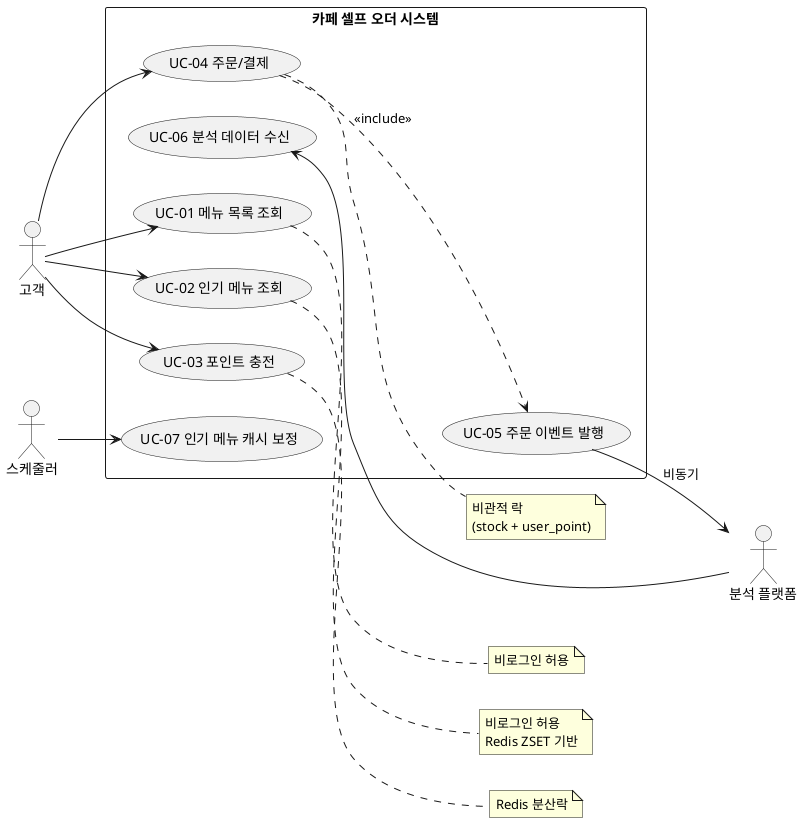

# 03. 유스케이스 명세서

> **버전**: v1.0
> **연관 문서**: 02. 사용자 시나리오, 04. 기능 명세서, 09. 동시성 제어 설계서

---

## 1. 액터 정의

| 액터 | 유형 | 설명 |
|------|------|------|
| 고객 (Customer) | 1차 액터 | 키오스크/모바일 앱 사용자. 인증 여부에 따라 사용 가능 기능이 다름 |
| 분석 플랫폼 (Analytics) | 외부 시스템 | Kafka `order.paid` 토픽 구독자. 본 시스템과 비동기 결합 |
| 스케줄러 (Scheduler) | 시스템 내부 | 시간 기반 트리거. 인기 메뉴 캐시 정합성 보정 담당 |

---

## 2. 유스케이스 다이어그램 (PlantUML)



---

## 3. 유스케이스 목록

| ID | 이름 | 액터 | 인증 | 락 전략 | 우선순위 |
|----|------|------|------|---------|----------|
| UC-01 | 메뉴 목록 조회 | 고객 | 불필요 | 없음 | 필수 |
| UC-02 | 인기 메뉴 조회 | 고객 | 불필요 | 없음 (캐시) | 필수 |
| UC-03 | 포인트 충전 | 고객 | 필요 | Redis 분산락 | 필수 |
| UC-04 | 주문/결제 | 고객 | 필요 | 비관적 락 | 필수 |
| UC-05 | 주문 이벤트 발행 | 시스템 (UC-04 include) | 해당 없음 | 없음 | 필수 |
| UC-06 | 분석 데이터 수신 | 분석 플랫폼 | 해당 없음 | 없음 | 필수 |
| UC-07 | 인기 메뉴 캐시 보정 | 스케줄러 | 해당 없음 | 없음 | 필수 |

---

## 4. 유스케이스 명세

### UC-01. 메뉴 목록 조회

| 항목 | 내용 |
|------|------|
| 액터 | 고객 (인증 불필요) |
| 선조건 | 메뉴 데이터가 시드로 적재되어 있음 |
| 후조건 | 메뉴 목록이 클라이언트에 전달됨 |

**기본 흐름**:
```
1. 고객이 메뉴 목록 조회 요청 (선택: categoryId)
2. 시스템: status=ACTIVE 메뉴를 카테고리 정보와 함께 조회
3. 응답: [{ menuId, name, price, categoryName, soldOut }]
```

**대안 흐름**:
- 카테고리 ID 미존재 → 빈 목록 반환

**예외 흐름**:
- DB 장애 → 500 `INTERNAL_ERROR`

---

### UC-02. 인기 메뉴 조회

| 항목 | 내용 |
|------|------|
| 액터 | 고객 (인증 불필요) |
| 선조건 | Redis ZSET 일별 키 적재 또는 DB 폴백 가능 |
| 후조건 | 최근 7일 Top 3 메뉴가 반환됨 |

**기본 흐름**:
```
1. 고객이 인기 메뉴 조회 요청
2. 시스템: Redis ZUNIONSTORE 로 최근 7일 ZSET 합산
3. ZREVRANGE 0 2 → Top 3 메뉴 ID 추출
4. 메뉴 정보 일괄 조회 후 응답
```

**대안 흐름 (캐시 미스)**:
```
1. Redis 키 부재 또는 비어있음
2. DB orders + order_items 7일 윈도우 GROUP BY 즉시 집계
3. 결과로 Redis ZSET 재구성 (TTL 8일)
4. 응답
```

**예외 흐름**:
- Redis + DB 모두 응답 불가 → 503 `SERVICE_UNAVAILABLE`

---

### UC-03. 포인트 충전

| 항목 | 내용 |
|------|------|
| 액터 | 고객 (인증 필요) |
| 선조건 | 유효한 JWT 보유 |
| 후조건 | user_point.balance 갱신 + point_history append |

**기본 흐름**:
```
1. 고객: POST /points/charge { amount }
2. 시스템: JWT 에서 userId 추출
3. Redisson tryLock("lock:point:{userId}", waitTime=3s, leaseTime=5s)
4. @Transactional 시작
   ├─ SELECT user_point WHERE user_id=? FOR UPDATE  ← 이중 안전장치
   ├─ balance += amount
   └─ INSERT point_history (CHARGE, amount, balance_after)
5. COMMIT → finally 에서 락 해제
6. 응답: { balance }
```

**대안 흐름**:
- 락 대기 타임아웃 (3초 초과) → 409 `LOCK_TIMEOUT`

**예외 흐름**:
- amount ≤ 0 → 400 `INVALID_AMOUNT`
- JWT 만료/위조 → 401 `UNAUTHORIZED`

---

### UC-04. 주문/결제

| 항목 | 내용 |
|------|------|
| 액터 | 고객 (인증 필요) |
| 선조건 | 유효한 JWT, 주문 메뉴 존재 및 ACTIVE 상태 |
| 후조건 | orders + order_items + point_history 저장, 재고/포인트 차감, Kafka 이벤트 발행 |

**기본 흐름**:
```
1. 고객: POST /orders { items: [{ menuId, quantity }, ...] }
2. 시스템: JWT 에서 userId 추출
3. @Transactional 시작
   ├─ items 의 menuId 오름차순 정렬 (데드락 방지)
   ├─ 각 menuId 에 대해
   │   ├─ menu 조회 (단가 스냅샷 확정)
   │   └─ stock SELECT FOR UPDATE → quantity 차감
   │       └─ 차감 결과 < 0 → STOCK_INSUFFICIENT 예외
   ├─ totalAmount 계산
   ├─ user_point SELECT FOR UPDATE → balance 검증 → 차감
   │   └─ balance < totalAmount → POINT_INSUFFICIENT 예외
   ├─ orders 저장 (CREATED → PAID)
   ├─ order_items 저장 (menu_name, unit_price 스냅샷 포함)
   └─ point_history append (USE, related_order_id 포함)
4. COMMIT
5. AFTER_COMMIT: Kafka order.paid 이벤트 발행 (UC-05 include)
6. 응답: { orderId, items, totalAmount, remainingPoint }
```

**대안 흐름**:
- 잔액 부족 → 트랜잭션 롤백 → 422 `POINT_INSUFFICIENT { shortage }`
- 재고 부족 → 트랜잭션 롤백 → 422 `STOCK_INSUFFICIENT { menuId }`

**예외 흐름**:
- 메뉴 미존재 / INACTIVE → 400 `MENU_NOT_AVAILABLE`
- JWT 만료/위조 → 401 `UNAUTHORIZED`

> **All or Nothing 정책**: 다중 메뉴 주문에서 일부만 성공하는 부분 성공은 허용하지 않는다.

---

### UC-05. 주문 이벤트 발행

| 항목 | 내용 |
|------|------|
| 액터 | 시스템 (UC-04 의 `<<include>>`) |
| 선조건 | 주문 트랜잭션 정상 커밋 |
| 후조건 | Kafka `order.paid` 토픽에 이벤트 적재 |

**기본 흐름**:
```
1. AFTER_COMMIT 트리거 (@TransactionalEventListener)
2. 페이로드 구성: { orderId, userId, items, totalAmount, occurredAt }
3. KafkaTemplate.send("order.paid", key=userId, payload)
```

**대안 흐름**:
- Kafka 발행 실패 → 로그 기록, 주문 트랜잭션은 영향 없음
- (분석 데이터 정합성은 UC-07 스케줄러로 보완)

> 트랜잭션 내부 발행 시 발생할 수 있는 "유령 이벤트" 문제를 방지하기 위해 AFTER_COMMIT 시점을 채택한다. Outbox 패턴 도입은 ADR 에서 검토 후 미선택.

---

### UC-06. 분석 데이터 수신

| 항목 | 내용 |
|------|------|
| 액터 | 분석 플랫폼 (외부) + 인기 메뉴 컨슈머 (내부) |
| 선조건 | Kafka `order.paid` 토픽 구독 중 |
| 후조건 | 분석 플랫폼 적재 + Redis ZSET 카운트 증가 |

**기본 흐름**:
```
1. Kafka order.paid 메시지 수신
2-A. [분석 플랫폼 컨슈머]
     - 외부 분석 시스템으로 HTTP/SDK 전송 (Mock)
2-B. [인기 메뉴 컨슈머]
     - dateKey = occurredAt 의 YYYY-MM-DD
     - items 각각에 대해 ZINCRBY popular:menu:{dateKey} {quantity} {menuId}
     - EXPIRE popular:menu:{dateKey} 8일
```

> 두 컨슈머는 별도 컨슈머 그룹으로 동일 토픽을 구독한다. 한쪽 장애가 다른 쪽에 영향을 주지 않는다.

---

### UC-07. 인기 메뉴 캐시 정합성 보정

| 항목 | 내용 |
|------|------|
| 액터 | 스케줄러 (cron) |
| 선조건 | 시스템 정상 가동 |
| 후조건 | Redis ZSET 일별 키가 DB 와 일치 |

**기본 흐름**:
```
1. 매일 03:00 트리거 (Spring @Scheduled)
2. 최근 7일 일별로 DB 집계
   SELECT menu_id, SUM(quantity)
   FROM order_items oi JOIN orders o ON oi.order_id = o.id
   WHERE o.created_at BETWEEN ? AND ?
   GROUP BY menu_id
3. 일별로 Redis ZSET 재구성 (DEL → ZADD)
4. 8일 이전 키 정리
```

> Redis 는 캐시이며 진실의 원천은 DB. 본 보정이 "메뉴별 주문 횟수가 정확해야 한다" 요구사항의 최종 보장 수단이다.

---

## 5. 인증·인가 매트릭스

| 유스케이스 | 인증 필요 | userId 추출 | 권한 |
|-----------|-----------|-------------|------|
| UC-01 메뉴 목록 조회 | ❌ | — | 모두 |
| UC-02 인기 메뉴 조회 | ❌ | — | 모두 |
| UC-03 포인트 충전 | ✅ | JWT subject | 본인 |
| UC-04 주문/결제 | ✅ | JWT subject | 본인 |
| UC-05 주문 이벤트 발행 | — | — | 시스템 내부 |
| UC-06 분석 데이터 수신 | — | — | 컨슈머 |
| UC-07 인기 메뉴 보정 | — | — | 스케줄러 |

> **userId 는 요청 본문이 아닌 JWT 페이로드에서만 추출한다.** 본문으로 받으면 인증된 사용자가 타인의 식별값을 임의로 넣어 호출하는 취약점이 발생한다.
